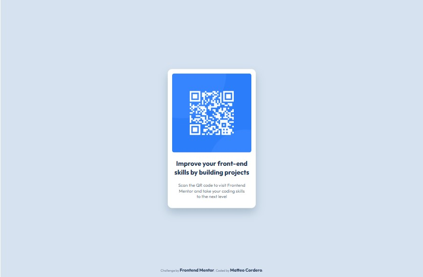

# Frontend Mentor - QR code component solution

This is a solution to the [QR code component challenge on Frontend Mentor](https://www.frontendmentor.io/challenges/qr-code-component-iux_sIO_H). Frontend Mentor challenges help you improve your coding skills by building realistic projects. 

## Table of contents

- [Overview](#overview)
  - [Screenshot](#screenshot)
  - [Links](#links)
- [My process](#my-process)
  - [Built with](#built-with)
- [Author](#author)

## Overview

### Screenshot

### Links

- Solution URL: [Solution Repository]([https://your-solution-url.com](https://github.com/Tadeusb/Challenge_Fontend_qr-code-component-main)
- Live Site URL: [Solution Page](https://tadeusb.github.io/Challenge_Fontend_qr-code-component-main)

## My process

### Built with

- Semantic HTML5 markup
- CSS custom properties
- Flexbox

## Author

- Frontend Mentor - [Tadeusb](https://www.frontendmentor.io/profile/Tadeusb)
- Twitter - [Matteo Cordero](https://x.com/Matteo_0XD)
